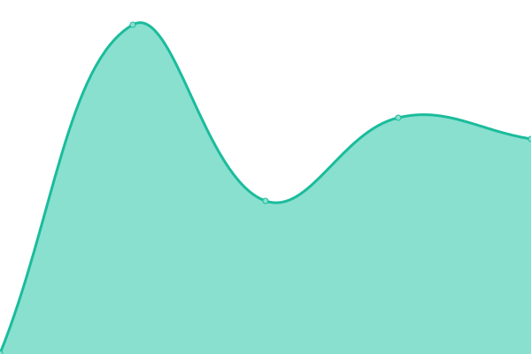

# [📈 Live Status](https://status.foorumi.co): <!--live status--> **Kaikki järjestelmät toiminnassa**

This repository contains the open-source uptime monitor and status page for [Foorumi.co](https://foorumi.co), powered by [Upptime](https://github.com/upptime/upptime).

With [Upptime](https://upptime.js.org), you can get your own unlimited and free uptime monitor and status page, powered entirely by a GitHub repository. We use [Issues](https://github.com/foorumico/status/issues) as incident reports, [Actions](https://github.com/foorumico/status/actions) as uptime monitors, and [Pages](https://status.foorumi.co) for the status page.

<!--start: status pages-->
<!-- This summary is generated by Upptime (https://github.com/upptime/upptime) -->
<!-- Do not edit this manually, your changes will be overwritten -->
<!-- prettier-ignore -->
| URL | Tila | Historia | Vasteaika | Ylhäälläoloaika |
| --- | ------ | ------- | ------------- | ------ |
|  [Foorumi.co](https://foorumi.co) | Ylhäällä | [foorumi-co.yml](https://github.com/foorumico/status/commits/HEAD/history/foorumi-co.yml) | 

 510ms
     
 | 

<a href="https://status.foorumi.co/history/foorumi-co">100.00%</a>
    

|  [Foorumi.co keskustelu](https://keskustelu.foorumi.co) | Ylhäällä | [foorumi-co-keskustelu.yml](https://github.com/foorumico/status/commits/HEAD/history/foorumi-co-keskustelu.yml) | 

 539ms
     
 | 

<a href="https://status.foorumi.co/history/foorumi-co-keskustelu">100.00%</a>
    

<!--end: status pages-->

[**Visit our status website →**](https://status.foorumi.co)

## 📄 License

- Powered by: [Upptime](https://github.com/upptime/upptime)
- Code: [MIT](./LICENSE) © [Foorumi.co](https://foorumi.co)
- Data in the `./history` directory: [Open Database License](https://opendatacommons.org/licenses/odbl/1-0/)
